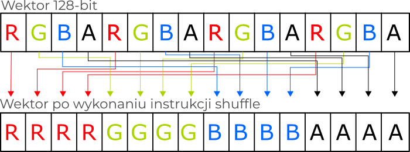
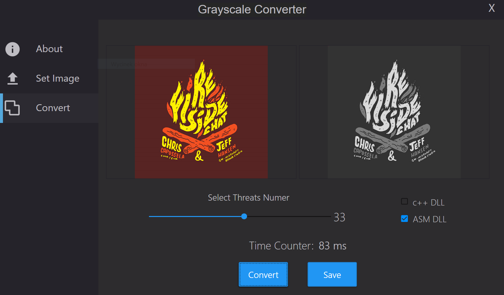
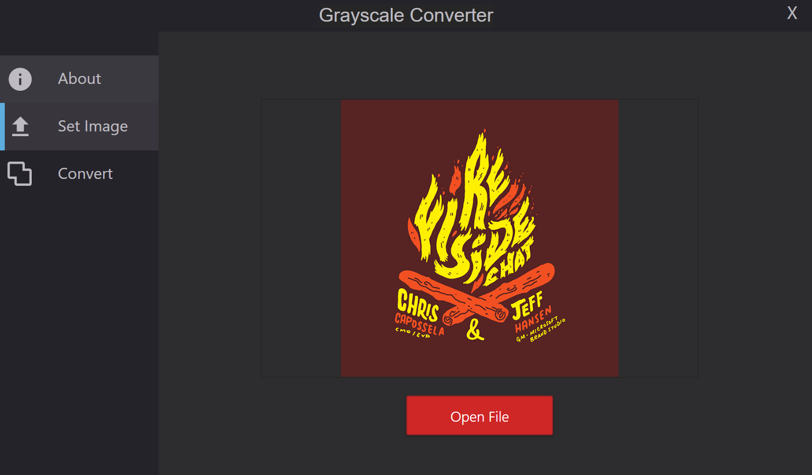
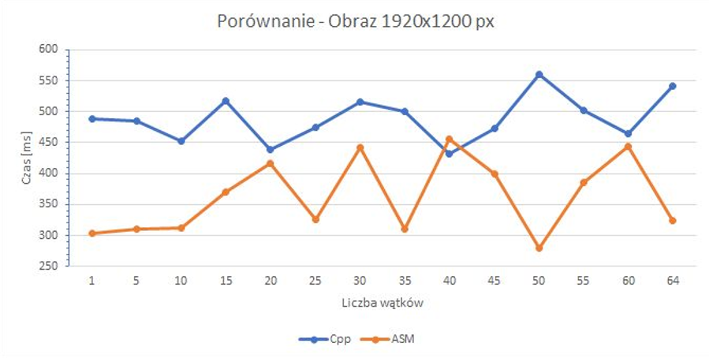

# Desktop App - Grayscale converter (Asm/Cpp)


Pliki źródłowe aplikacji desktopowej służącej do konwersji obrazów o formacie JPG na skalę szarości. Sam algorytm wykorzystany w programie napisany został w języku assemblera oraz C++ z wykorzystaniem modelu SIMD. Aplikacja utrzymana jest w ciemnej kolorystyce oraz umożlwia wybór ilośći watków i biblioteki DLL.<br>

## [0.1.0] - 2020-01-15

### Dodano

- Możliwość wyboru biblioteki dll (Asm/Cpp).
- Opcja wyboru ilości wątków (1-64).
- Możliwość zapisu przekonwertowanego obrazu.
- Opis wewnątrz aplikacji.
- Zabezpieczenie przed brakiem instrukcji wektorowych w procesorze.


## Technologie

Przy tworzeniu aplikacji zostały wykorzystane następujące technologie:

- Visual Studio 2017 - Środowisko programistyczne.
- .Net 4.7.1         - Framework wykorzystany do stworzenia aplikacji.
- C#                 - Język programowania, w którym została napisana część obsługi widoków.
- Asm                - Język programowania niskiego poziomu wykorzystany do napisania algorytmu konwersji.
- C++                - Język programowania wysokiego poziomu wykorzystany do napisania algorytm konwersji.
- SIMD               - Model architektury umożliwiający wykonywanie wielu operacji na dużej ilości danych jednocześnie.

## ALgorytm instrukcji wektorowych

Dane przekazywane do biblioteki dll napisanej w języku c++ oraz assemblera odbierane były docelowo jako wskaźnik na tablicę w pamięci o wartości 128 bitów każda. Podział na tablice wykonywany był w części programu napisanej w języku C#, dzięki czemu możliwe było wykorzystanie wielu wątków do obliczeń wartości pixela w skali szarości.

Przekazywana tablica zawierała 16 pixeli każdy po 8 bitów (kanały Red, Green, Blue i Alpha). Tablica wpisywana była w wektor 128-bitowy oraz następnie wykonywana została instrukcja shuffle przestawiająca kanały w sposób zaprezentowany na grafice poniżej.

<p align="center">

  <br>
Wizualizacja przetasowania w odpowiednie miejsca wartości rejestru początkowego.  
</p>

Po ułożeniu pixeli na odpowiedniej tablicy zostały wyodrębnione poszczególne kanały tak zby każdy z nich znajdował się w dolnej częsci osobnego rejestru. Operacja ta została wykonana za pomocą instrukcji przesunięć bitowych (w prawo oraz w lewo).

<p align="center">

  <br>
Przykład otrzymanego rejestru po przesunieciach bitowych eliminujących pozostałe kanały.  
</p>

Aby obliczyć skalę szarości został zastosowany algorytm polegający na obliczeniu średniej ważonej poszczególnych kanałów pixela.

```
Gray(R, G, B) ＝ R x 0.29891 + G x 0.58661 + B x 0.11448
```

Aby pomnożyć wyrazy o długości wyrazu 8-bit przez stała należy rozszerzyć każdy 8-bitowy wyraz do wyrazu 16-bitowego.

<p align="center">

  <br>
Przykład ułożenia wyrazów po rozszerzeniu do epi16.  
</p>

Następnie każdy rejestr zawierający odrębny kanał o długości wyrazu 16-bit (short) został pomnożony przez stała o odpowiedniej wartości. Na koniec wszystkie rejestry zostały zsumowane, a wartości przepisane do wskazanej jako parametr wejściowy tablicy.

## Zrzuty ekranu z aplikacji

<p align="center">

  <br>
Okno wyboru ilości watków, biblioteki źródłowej oraz zapisu obrazu.  
</p>

<p align="center">

  <br>
Widok wyboru obrazu do konwersji.  
</p>

<p align="center">

  <br>
Wykres pokazujący różnice w czasie wykonywania operacji algorytmów napisanych w Asm oraz c++.  
</p>
